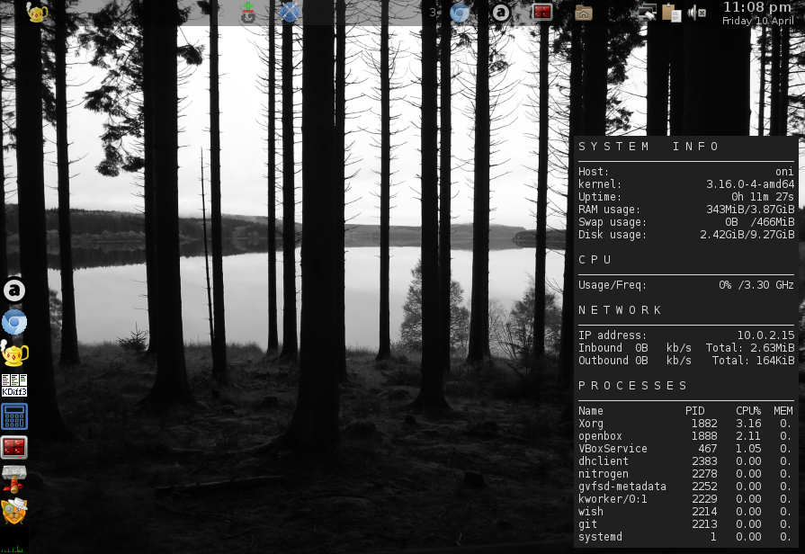

# Oni

### My Openbox Network Install script for Debian

Oni is an attempt at automating the installation and configuration of my preferred system set-up.

### Warning!

Oni should only be installed on fresh **core system only** installs of Debian 8. Running the install against other Debain based distributions, or systems not in a fresh state may result in a broken system!

### Set-up, Download and Install....

The install script assumes sudo is installed and that your current user is a member of the sudo group. This can be accomplished by executing the following commands.

```
su
<root_password>
apt-get update
apt-get install sudo
sudo adduser <user_name> sudo
exit
exit
<user_name>
<user_password>
```

Once sudo is configured execute the following commands to download and install Oni.

```
wget https://github.com/robertcalvert/Oni/archive/master.tar.gz
tar -xpf master.tar.gz
cd Oni-master
./oni-install
```

Once the install is complete you will be prompted to reboot.

### /system/opt/.

Packages not found in the Debian repositories are provided in the /system/opt/ folder, please see the accompanying README, LICENSE and CREDITS files for more information about these packages.

### Wallpaper

The default wallpaper is a photograph of Kielder reservoir taken by my better half [Ame Mayfield].

### Screenshot



---

## License

Copyright (c) 2015 Robert Calvert ([robert.calvert.io])

See the license file for license rights and limitations (GPLv2).

[robert.calvert.io]:http://robert.calvert.io
[Ame Mayfield]:https://ello.co/amemayfield